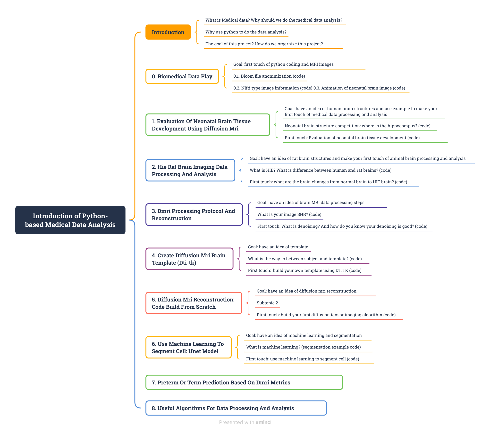
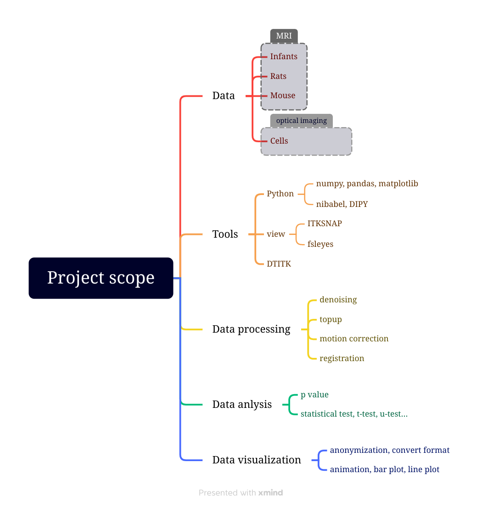

# An Introduction To Python-based Biomedical Data Analysis
*Erjun Zhang* (Institute of Biomedical Engineering, Polytechnique Montreal; NeuroPoly Lab, Polytechnique Montreal; 
Magic Lab, CHU Sainte-Justine Research Center, University of Montreal)

## Introduction
Initiating a career in bio-imaging can be daunting, particularly for newcomers. It may take them years before stepping
into bio-imaging through traditional school learning. Existing online materials is either two theories or unable to
reproduce for new beginners. Our project, An Introduction to Python-based Bio-Medical Data Analysis, addresses this
challenge through a series of comprehensive mini-projects designed to demystify bio-imaging data processing and
analysis. We aim to facilitate smooth entry into the field for aspiring researchers.

## Content
To reach our goal, I have developed 8 mini-projects for this project:

*Table of contents*

Each mini-project uses open-source bioimaging data and popular programming language Python to complete data
preprocessing, reconstruction, and visualization. We will document every step of the process and make all materials
freely available on GitHub

## Scope

## Originality
This project draws inspiration from Taoist philosophy: the Great Way is simple (Laozi). It challenges traditional barriers
to entry in bio-imaging research by prioritizing simplicity and accessibility. We challenge the status quo by

1. Through a series of straightforward yet impactful mini-projects, participants gain exposure to state-of-the-art
scientific research in a supportive learning environment.
2. Participants engage directly with the project from the outset, bypassing the conventional approach of beginning
with theoretical learning, which is often tedious and discouraging for participants.
3. All materials, including code, data, results, and publications, are openly accessible and shared in GitHub
repositories as open-source resources.
4. The participants collaborate with each other and the applicant, fostering mutual learning and teaching.
5. Our completed mini-project demonstrates that these mini-projects and methods can be effectively embraced by
college and early-year university students, thereby inspiring future learners.

## Dependencies
All the experiments can be completed online using either Windows, Mac or Linux computer.
* [Python 3](https://dti-tk.sourceforge.net/pmwiki/pmwiki.php?n=Main.HomePage), [Google colab notebooks](https://colab.research.google.com/) (or [Jupyter notebook](https://jupyter.org/))

* [DIPY](https://dipy.org/): nifti file loader and saver;
* Matplotlib, ipython widgets: data visualization;
* Useful tools: [ITK-SNAP](http://www.itksnap.org/pmwiki/pmwiki.php) for viewing nifti files locally, fsl-bet for creating human brain masks.

## Conclusion
This ongoing bio-imaging project, An Introduction to Python-based Bio-Medical Data Analysis, consists of 8 case-based
mini-projects derived from the applicant’s early research experience. Each mini-project focuses on a specific aspect of
bio-imaging data processing and analysis, with corresponding GitHub repositories containing code, data, results, reports,
posters, slides, and video presentations. All the materials are openly accessible, promoting collaboration and learning
among researchers from diverse backgrounds. It will be updated each week and is expected to complete by the end of 2024.

*Acknowledgement*

The main work of this project was done at Magic lab in CHU Sainte-justine hospital research center (UdeM) and at NeuroPoly Lab in Polytechnique Montreal. Part of them was completed by participants with my mentorship from different institute: University of Montreal, Dawson College, University of Waterloo and University of Albert. We thank TransMedTech Institute for generously providing us with a conducive and comfortable working environment and support. I also would like to thank my supervisor Dr. De Leener, and Dr. Lodygensky for their supports throughout this project.
