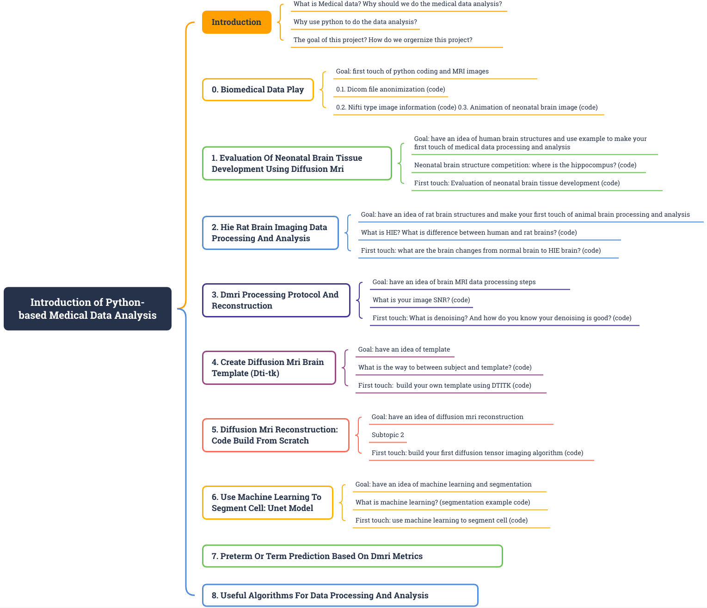

# An Introduction To Python-based Biomedical Data Analysis
*Erjun Zhang* (Institute of Biomedical Engineering, Polytechnique Montreal; NeuroPoly Lab, Polytechnique Montreal; 
Magic Lab, CHU Sainte-Justine Research Center, University of Montreal)

## Introduction
Initiating a career in bio-imaging can be daunting, particularly for newcomers. It may take them years before stepping
into bio-imaging through traditional school learning. Existing online materials is either two theories or unable to
reproduce for new beginners. Our project, An Introduction to Python-based Bio-Medical Data Analysis, addresses this
challenge through a series of comprehensive mini-projects designed to demystify bio-imaging data processing and
analysis. We aim to facilitate smooth entry into the field for aspiring researchers.

## Content

To reach our goal, I have developed 8 mini-projects for this project:
1. Evaluation of Neonatal Brain Tissue Development Using Diffusion MRI
2. HIE rat brain imaging data processing and analysis
3. dMRI Processing Protocol and Reconstruction
4. Use DTITK To Build Template And Do Registration
5. Diffusion MRI reconstruction: code build from scratch
6. Use machine learning to segment cell: UNet Model
7. Preterm or term baby prediction age prediction
8. Useful algorithms for data processing and analysis

Each mini-project uses open-source bioimaging data and popular programming language Python to complete data
preprocessing, reconstruction, and visualization. We will document every step of the process and make all materials
freely available on GitHub

## Scope
Our project encompasses a broad spectrum of bio-imaging research, covering data acquisition, preprocessing, recon-
struction, and visualization. By utilizing diverse datasets, including human brain MRI, rodent brain MRI, and cell
optical imaging, participants gain exposure to a wide range of imaging in modalities and analytical techniques. From
user-friendly software applications like ITKSNAP and FSLEYES to coding in Python, our project equips participants
with essential skills applicable across various bio-imaging disciplines.

## Originality
This project draws inspiration from Taoist philosophy: the Great Way is simple (Laozi). It challenges traditional barriers
to entry in bio-imaging research by prioritizing simplicity and accessibility. We challenge the status quo by

1. Through a series of straightforward yet impactful mini-projects, participants gain exposure to state-of-the-art
scientific research in a supportive learning environment.
2. Participants engage directly with the project from the outset, bypassing the conventional approach of beginning
with theoretical learning, which is often tedious and discouraging for participants.
3. All materials, including code, data, results, and publications, are openly accessible and shared in GitHub
repositories as open-source resources.
4. The participants collaborate with each other and the applicant, fostering mutual learning and teaching.
5. Our completed mini-project demonstrates that these mini-projects and methods can be effectively embraced by
college and early-year university students, thereby inspiring future learners.
## Conclusion
This ongoing bio-imaging project, An Introduction to Python-based Bio-Medical Data Analysis, consists of 8 case-based
mini-projects derived from the applicant’s early research experience. Each mini-project focuses on a specific aspect of
bio-imaging data processing and analysis, with corresponding GitHub repositories containing code, data, results, reports,
posters, slides, and video presentations. All the materials are openly accessible, promoting collaboration and learning
among researchers from diverse backgrounds. Notably, the project has facilitated the smooth entry of 8 participants into
the bio-imaging field within a year and has gained popularity within the neuroscience club of one college. It is expected
to impact several tens of others in health science-related fields in 2024.

*Acknowledgement*

We extend our sincere gratitude to the potential institute and orgernization for their invaluable financial support for this mini-project. Our heartfelt thanks also go out to TransMedTech for generously providing us with a conducive and comfortable working environment and support. Finally, we would like to thank our supervisor Dr. De Leener, and Dr. Lodygensky for their supports throughout this project.
